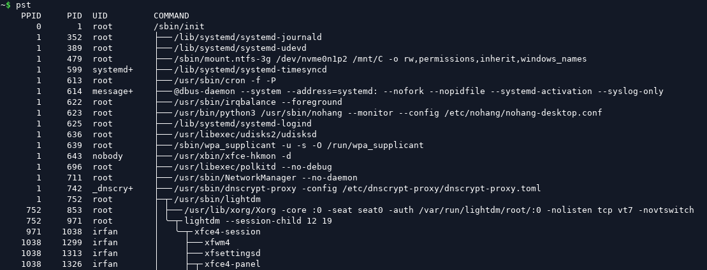

## `pst`

View Linux / Android process tree.

`pst` is simplified [`pstree`](https://man7.org/linux/man-pages/man1/pstree.1.html) + [`pgrep`](https://man7.org/linux/man-pages/man1/pidwait.1.html).

```
~$ pst -h

Usage:
	pst [options] [pid1 pid2 ...] [cmd1 cmd2 ...]

	Parses Linux procfs and prints process tree of all or given processes.

Options:
	-o, --opt <opt,...>   Print only given columns
	                      Columns: all, ppid, pid, tty, uid, ram*, swap*, cpu, age, io*, cmd
	--kernel              Show kernel threads
	--threads             Show process threads
	--rss                 Show RSS RAM and SWAP instead of PSS
	--cpu-time            Show CPU time instead of percentage
	--total-io            Include I/O of dead threads and dead child processes
	--no-tree             Print only given processes, not their child tree
	--no-full             Match only the cmd part before first space, not the whole cmdline
	--no-pid              Treat the numerical argument(s) as cmd, not pid
	--no-name             Do not try to resolve uid to user name
	--no-header           Do not print header
	--no-trunc            Do not fit lines to terminal width
	--ascii               Use ASCII characters for tree art
	-v, --verbose         Print all errors
	-h, --help            This help message

	* Required capabilities: CAP_SYS_PTRACE and CAP_DAC_READ_SEARCH

~$ sudo setcap cap_sys_ptrace,cap_dac_read_search+ep /usr/local/bin/pst
```


